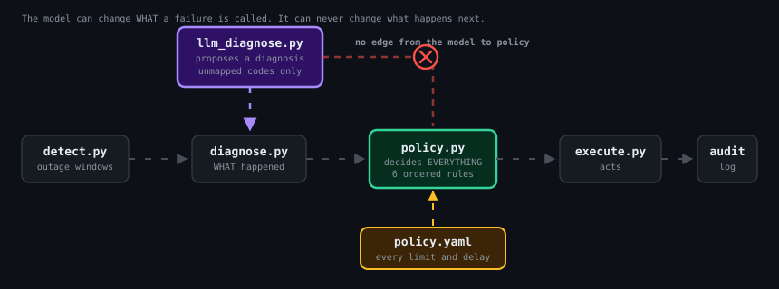
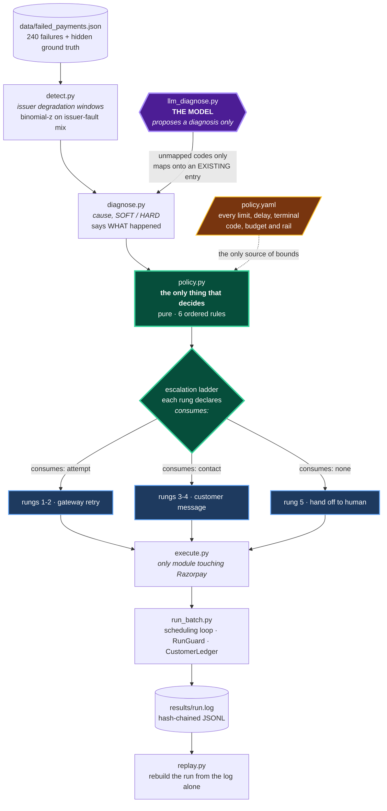

# Architecture

Two pages. The README has the results and the argument; this is the shape of
the Bounded Recovery Agent, where the model sits, and what happens when
things break.

---

## 1. The flow

<p align="center">
  
</p>



**There is no arrow from the model to `policy.py`.** That absence is the
security property, not a drafting shortcut. The model reaches `diagnose.py`
and stops, and only for codes the taxonomy does not have. Every number that
follows — which delay, how many attempts, whether a customer may be contacted
at all — comes from `policy.yaml` along the dotted edge.

Enforced in two places, deliberately: a `retry_permitted` predicate in the
YAML, **and** a `PolicyViolation` raised in `policy.py` that a YAML edit
cannot bypass. `tests/test_stopping_rules.py` deletes the predicate and
asserts the code still refuses.

The trail shows the split rather than claiming it:

```
retry_windows.ISSUER_DOWN[llm_proposed].delays_minutes[0]
```

The model said *what the failure is*. `policy.yaml` said *what to do about
that kind of failure*. The rule path records which was which.

---

## 2. Two budgets

<p align="center">
  
</p>

Gateway attempts and customer contacts are separate resources with separate
caps. **Exhausting one never spends or cancels the other.**

| | `consumes: attempt` | `consumes: contact` |
|---|---|---|
| rungs | 1–2 | 3–4 |
| ceiling | `max_attempts: 4` | `max_customer_contacts_per_transaction: 2` |
| spacing | `cooldown_hours: 6`, per-code overrides | `min_hours_between_contacts: 24` |
| per customer | `max_attempts_per_customer_per_day: 5` | `max_contacts_per_customer_per_24h: 2` (rolling) |
| time-of-day | none | `contact_hours_ist: 09:00–21:00` |
| repeatable | yes — each firing is a distinct retry | no — twice is a duplicate |

Rung 5 (`consumes: none`) spends neither, so it stays reachable after both
are exhausted. A transaction is never simply dropped.

This is where the deepest bug lived. Stopping rules 2 and 3 used to return
STOP and end the transaction, so rungs 3–5 were unreachable: the run made
**zero customer contacts**, three of five rungs were dead code while
`policy.yaml` advertised them, and `Customers contacted: 0` sat in the cost
table reading like restraint when it was a bug. Rules 2 and 3 now *foreclose
retries* instead of ending the transaction. A hard decline closes the
gateway, not the customer — an expired card is exactly the case where asking
the customer to act is the only thing that can work.

Measured on the run's own audit log: 406 messages, **zero** outside contact
hours, **zero** over the per-transaction quota, **zero** closer than the 24h
spacing rule, worst case exactly **2** to any customer in any rolling 24h.

---

## 3. Failure modes

**Thesis: every path fails closed.** A component that is broken, slow,
missing, or lying can make the agent do *less*, never more. The conservative
destination is `unmapped_code_fallback: UNKNOWN` — one retry at +360 min,
then a human — which was written in phase 2 to settle a cooldown-override
argument, long before any model was planned.

| Failure | Handling | Where |
|---|---|---|
| LLM returns a code outside the taxonomy | → UNKNOWN, conservative retry | `llm_diagnose.py` closed output set |
| LLM answers `UNSURE` | → UNKNOWN (the prompt offers this deliberately) | same path |
| LLM returns malformed output | → UNKNOWN, `REJECTED_MALFORMED` | `_extract_json` |
| LLM confidence below floor | → UNKNOWN, `REJECTED_LOW_CONFIDENCE` | `min_confidence: 0.70` |
| LLM API error | → UNKNOWN, `FAILED_TRANSPORT` | `_call_api` |
| LLM timeout | → UNKNOWN, `FAILED_TIMEOUT` | a slow model is never permission |
| Missing API key | → UNKNOWN, `FAILED_NO_CREDENTIALS`, logged | ordinary state, not a crash |
| Transport raises internally | → `FAILED_TRANSPORT`, **original error preserved** | see below |
| Unknown predicate name in YAML | → treated as UNMET (fails closed) | `PREDICATES` lookup |
| Retry predicate deleted from YAML | → `PolicyViolation` raised, run halts | `_build_rung_decision` |
| Gateway 4xx/5xx | → exponential backoff + jitter, honours `Retry-After`, logged | `RateLimiter` |
| Live key detected | → `LiveKeyRefused`, refuses to start | `rzp_test_` prefix required |
| Secret about to be written to the log | → `SecretLeak` raised before the write | `_assert_no_secret` |
| Issuer degraded | → HOLD until the window clears, attempt preserved | rule 5 |
| Batch spend ceiling reached | → batch halts, logged with the rule path | `RunGuard.before_execute` |
| Live decline rate above threshold | → batch halts | `RunGuard`, **live mode only** |
| Policy defers forever | → `MAX_PASSES` cap, `wait_abandoned` logged | `_work_transaction` |
| Retry scheduled past the horizon | → abandoned, logged with the reason | same |

Two of these deserve their own note.

**Transport raises internally.** Provider routing supported two transport
signatures by calling with six arguments and catching `TypeError`. That
conflates "this takes five parameters" with "this has a bug". A genuine error
inside a transport was swallowed, retried at the wrong arity, and surfaced as
`missing 1 required positional argument: 'provider'` — the real error
destroyed and replaced by a message naming a different problem. It also
escaped `propose()`, which promises to always return a `Proposal`, so a
provider bug would have killed a whole batch instead of degrading to UNKNOWN.
Fail-open, in the module built to fail closed. Arity is now read from the
signature; any exception becomes `FAILED_TRANSPORT` with the original message
intact.

**Decline-rate breaker is armed only in live mode** (`enforce_decline_breaker
=live`). In a dry run, outcomes come from ground truth rather than a gateway,
so a "decline rate" would not be a real signal. Stated here because a guard
that silently does nothing in the default configuration is the kind of thing
this project has been bitten by before.

---

## 4. Real vs simulated

Also in the README, repeated here so an architecture reader need not go
looking.

| Component | Status |
|---|---|
| Razorpay order creation | **Real.** Live calls against test mode, with `--live`. Rate limited, backed off, timed. |
| Razorpay authorisation outcome | **Simulated.** The S2S payments API returns 401 (not activated on this account), so authorisation cannot be driven server-side. Whether a retry would have succeeded is read from planted ground truth. |
| Customer messages | **Stubbed.** The full payload is built, validated against the compliance rails and logged, with `delivered: false, stubbed: true` on every line. Nothing is transmitted. No provider is wired. |
| LLM classification | **Real** when a key is present and a code is unmapped. The shipped batch never calls it — all eight of its codes are mapped — so `src/run_ai_demo.py` exercises the path offline and deterministically. |
| Failure batch | **Synthetic**, 240 transactions, deterministic by seed, generated by `src/generate_data.py`. |
| Recovery windows | **Synthetic and modelled.** Corrected once under pre-registration; see `WINDOW_MODEL.md`. |
| Audit trail | **Real.** Hash-chained JSONL, verified each run, and `replay.py` rebuilds the run from the log alone. |
| Costs (₹2.50/attempt, ₹1.00/message) | **Assumptions**, not measurements. Overridable on the command line. |

The agent has never recovered a real rupee, and no customer has ever received
a message from it.
