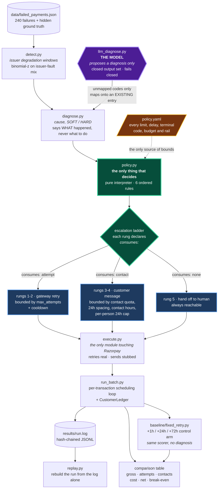

# Payment Recovery Agent

Razorpay AI Buildathon — **Track 3, AI Revenue Recovery**

Takes a batch of failed payments, works out why each one failed, picks a
bounded recovery action from a declarative policy, executes it against
Razorpay test-mode APIs, and produces an audit trail complete enough to
reconstruct the entire run without the code.

**The headline result is that the agent recovers less gross revenue than a
naive baseline.** That is reported first, explained in section 1, and not
buried. 93% of the remaining gap is revenue our compliance policy forbids us
from touching.

---

## 60-second quickstart

```bash
git clone https://github.com/thulasiramk-2310/revenue-recovery-agent.git
cd revenue-recovery-agent
pip install -r requirements.txt

python -m src.generate_data          # build the 240-transaction batch
python -m src.run_batch              # run agent + baseline, print the table
python -m src.run_ai_demo            # show the bounded AI diagnosis path
python -m src.replay --compare       # rebuild the run from its log alone
python -m unittest discover -s tests # 149 tests
```

No API keys needed for any of that — the default is a dry run that touches no
network. To make real calls against Razorpay **test mode**:

```bash
cp .env.example .env                 # add your rzp_test_ keys
python -m src.run_batch --live --limit 25
```

---

## Where the AI is used

The core recovery policy is deliberately deterministic. That is the safety
choice: an LLM should not be able to decide to retry a blocked card, raise an
attempt limit, contact a customer outside permitted hours, or spend past the
batch ceiling.

AI is used at the diagnosis boundary, where it is valuable and bounded:

1. Known gateway failure codes use the hand-written taxonomy in
   `src/diagnose.py`.
2. Unknown gateway failure codes go to `src/llm_diagnose.py`.
3. The model may return only one existing taxonomy code, or `UNSURE`.
4. The model never chooses the action. `policy.yaml` and `src/policy.py`
   still decide retry, hold, customer contact, handoff, or stop.
5. Every accepted or rejected proposal is logged with model, prompt version,
   confidence, raw response, and verdict.
6. If the model is wrong, slow, offline, malformed, or missing credentials,
   the system falls back to the conservative `UNKNOWN` policy.

The fastest way to show this to judges is:

```bash
python -m src.run_ai_demo
```

That command uses an offline deterministic model fixture by default, so it is
repeatable and needs no API key. It creates an unmapped code,
`ISSUER_UNAVAILABLE_TRY_LATER`, maps it to the existing `ISSUER_DOWN`
diagnosis, applies an already-detected issuer degradation signal, and shows
the policy choosing `HOLD`. Use `--live-llm` only if you deliberately want to
call the configured model.

To use a real LLM call for that demo:

```bash
cp .env.example .env
# add GROQ_API_KEY to .env
python -m src.run_ai_demo --live-llm
```

The batch runner uses the same LLM path when it sees an unmapped code in the
input batch. The standard generated batch mostly uses known codes, so
`run_ai_demo` is the clean way to make the AI path visible without changing
the benchmark.

`policy.yaml` defaults this live path to Groq
(`provider: groq`, `model: llama-3.3-70b-versatile`) through Groq's
OpenAI-compatible chat completions API. Anthropic is still supported by
changing the provider/model and setting `ANTHROPIC_API_KEY`.

The point to say out loud: **the LLM diagnoses uncertainty; the policy moves
money.**

---

## What is real and what is not

Read this before the numbers.

| | Status |
|---|---|
| Failed-payment batch | **Synthetic.** 240 generated transactions with planted ground truth. |
| Order creation | **Real.** `POST /v1/orders` against test mode; order ids fetch back from the API. |
| Authorisation outcome | **Simulated** against ground truth — see below. |
| Customer messages | **Stubbed. Nothing is ever sent.** Full payload logged, marked `delivered: false`. |

Razorpay exposes no server-side way to drive a card authorisation with an
ordinary key pair. Verified rather than assumed:

```
POST /v1/orders              -> 200   order created
POST /v1/payments  (S2S)     -> 401   Authentication failed (S2S not activated)
POST /v1/payments/create/upi -> 400   URL not found
```

So the agent creates real orders and resolves *whether the attempt would have
succeeded* against ground truth. Every audit line carries `gateway_call`
(`real`/`none`) and `outcome_source` (`gateway`/`ground_truth_simulation`/
`stubbed`). **Nothing here reports a captured payment that did not happen.**

---

## Architecture

> Full detail in **[ARCHITECTURE.md](ARCHITECTURE.md)** — the flow, the two
> budgets, a failure-mode table, and what is real versus simulated.

<p align="center">
  
</p>

The animation traces the live path. The red cross marks the edge that **does
not exist** — the model can change what a failure is *called*, and can never
change what happens next.

The two things worth reading off this diagram are **where the model sits** and
**where it does not reach**.



**There is no arrow from the model to `policy.py`.** That absence is the
security property, not a drafting shortcut. The model reaches `diagnose.py`
and stops there, and it only reaches it for codes the taxonomy does not have.
Every number that follows — which delay, how many attempts, whether a
customer may be messaged at all — comes from `policy.yaml` along the dotted
edge.

The split in the middle is the second thing to read: **attempts and contacts
are separate budgets**, and exhausting one disables only the rungs that spend
it. A hard decline closes the gateway path and keeps the contact path open,
which is the whole reason an expired card gets a message instead of silence.

Three rules hold the design together:

1. **`policy.py` contains no failure codes, delays, or thresholds.** They all
   live in `policy.yaml`, and every decision cites the dotted YAML path that
   produced it. A test scans the source to enforce this.
2. **Diagnosis is separate from action.** `diagnose.py` says what happened;
   only `policy.py` says what to do. The LLM sits on the diagnosis side of
   that line and cannot cross it — enforced twice, by a predicate in the YAML
   and by a `PolicyViolation` raise that a YAML edit cannot bypass.
3. **A decision *not* to act is still a decision** and still gets a logged
   reason and rule path.

The trail shows the split rather than claiming it. A retry chosen after the
model classified an unfamiliar code cites:

```
retry_windows.ISSUER_DOWN[llm_proposed].delays_minutes[0]
```

The model said *what the failure is*; `policy.yaml` said *what to do about
that kind of failure*; the rule path records which was which.

---

## 1. Measured money recovered across a batch

240 transactions worth ₹542,522.78. Recoverable ceiling — straight from
`would_recover_if_retried_at` — is **112 transactions / ₹202,447.60**, 37.3%
of batch value. Every rate below is against that ceiling, not against the
batch total, because the batch total includes money nobody could ever get.

```
                                      Agent         Baseline
  ----------------------------------------------------------
  Gross recovered              Rs 85,228.95     Rs 98,475.41
                                    37 txns          38 txns
  Attempts                              215              693
  Messages sent                         406                0
  Customers contacted                   104                0
  Cost                            Rs 943.50      Rs 1,732.50
  Net recovered                Rs 84,285.45     Rs 96,742.91
  Rs per attempt                  Rs 396.41        Rs 142.10
  Capture vs ceiling                  42.1%            48.6%
```

Costed at ₹2.50 per gateway attempt and ₹1.00 per message — assumptions, not
measurements, and overridable. Cost follows **messages sent**, not people
reached: 406 messages to 104 customers costs 406 sends, and charging per
customer would silently discount every follow-up. Both columns appear because
they measure different things — sends drive the rupee cost, reach drives the
goodwill cost, and the goodwill cost is deliberately **not** monetised rather
than given an invented figure.

**The agent loses on gross by ₹13,246.46 and on net by ₹12,457.46.** Costing
attempts does not rescue it: an attempt would have to cost ₹28.56 — 11× the
assumption, far above real Indian PG economics — for the efficiency argument
to carry the result.

The contact rungs recover **₹0**, and that is a property of the data, not a
finding about dunning. Ground truth models recovery as a function of retry
*timing* only; a customer receiving an email and updating their card is not
something this batch represents. Contacts are therefore pure cost here —
₹406 of the agent's ₹943.50 — and the honest reading is that this
measurement can show escalation is *compliant and bounded*, not that it
*works*.

### Where that gap actually comes from

| | |
|---|---|
| Gross gap | ₹13,246.46 |
| …of which the baseline collects from transactions our policy forbids us to retry | **₹12,296.20 — 92.8%** |
| **Like-for-like gap** | **₹950.26** |

On the ground the two arms actually share, they are within **0.96%** of each
other — and the agent gets there with **3.2× fewer attempts**. See section 5.

### Method

Both arms are scored by the same function (`execute.resolve_outcome`) against
the same ground-truth windows on the same batch. Neither marks its own
homework. An attempt succeeds only if it lands inside
`[would_recover_if_retried_at, recovery_window_closes_at]` — money arrives,
then gets spent, so retry *timing* matters and not merely retry *count*.

The baseline is verified blind: it spends the full 3 attempts on every hard
decline (`n×3` exactly for all four terminal codes — 384 attempts across 128
unrecoverable transactions, recovering none). Five tests fail if anyone makes
it smarter, because a baseline that quietly diagnoses would be using the
knowledge the agent is credited for.

### A phase-1 modeling error, found and corrected

The first version of this batch gave **99.1% of recovery windows a width over
48 hours**, median 6.5 days. That is wrong, and it invalidated the central
claim the ground truth exists to support: if any retry within a week
succeeds, timing cannot matter and a blind sprayer is optimal by
construction. On those windows the baseline captured 86.0% of the ceiling
against the agent's 51.4%.

Correcting this makes the agent look better, which is exactly the problem — a
correction that helps its author is indistinguishable from tuning. So the new
widths and a per-code justification were **written and committed before the
generator was touched or anything was re-measured**:
[`WINDOW_MODEL.md`](WINDOW_MODEL.md), commit `2537a81`. The git ordering is
the evidence.

Three widths were narrowed on grounds of how the condition behaves — a
transport timeout resolves in minutes, an issuer outage bounds its own
window, a balance failure recovers at a credit event rather than over five
days. Two were held: `DO_NOT_HONOR` stays wide because issuer discretion
genuinely is not tightly bounded, and `CARD_BLOCKED` stays because the agent
never retries it, so its width only affects how much the *baseline* collects.

Isolating the change took care. `random.randint` consumes a variable number
of bits depending on its range, so editing a range desynchronised the shared
stream and changed the batch itself — the ceiling moved from 112 to 94
transactions. Window widths are now drawn from a separate stream, and the
corrected batch is bit-identical to phase 1 in every respect except width.

### Sensitivity: the operating range

One comparison at one width is a point estimate dressed as a finding. The
curve is the honest version — `python -m src.sensitivity`:

| median width | agent | baseline | gross gap | agent n | base n | like-for-like |
|---:|---:|---:|---:|---:|---:|---:|
| 0.9h | ₹32,235 | ₹35,808 | ₹3,573 | 233 | 717 | base +3,573 |
| 1.8h | ₹32,534 | ₹41,444 | ₹8,910 | 233 | 716 | base +6,111 |
| 4.5h | ₹43,781 | ₹65,152 | ₹21,371 | 228 | 698 | base +11,574 |
| 9.0h | ₹73,915 | ₹90,453 | ₹16,539 | 219 | 695 | base +4,242 |
| **18.0h** | **₹85,229** | **₹98,475** | **₹13,246** | **215** | **693** | **base +950** |
| 36.0h | ₹86,886 | ₹109,805 | ₹22,919 | 215 | 675 | base +10,623 |
| 72.0h | ₹96,702 | ₹127,073 | ₹30,371 | 213 | 639 | base +18,075 |
| 144.0h | ₹100,141 | ₹169,578 | ₹69,436 | 213 | 620 | base +57,140 |
| 576.0h | ₹100,721 | ₹174,022 | ₹73,301 | 213 | 611 | base +61,004 |

**There is no crossover. The agent loses at every width, on gross, on net and
like-for-like.** It comes closest at the shipped 18h width, within 0.96%.

The shape is the interesting part. As windows widen, the baseline's advantage
grows without limit while the agent's recovery plateaus around ₹100k — extra
duration rewards extra attempts, and the agent is capped at ~215 by design.
Below ~2h both collapse: the opportunity is too short for anyone to hit
reliably, and the baseline's volume still wins on raw coverage.

This is a real engineering position, stated plainly: **a bounded agent trades
gross recovery for efficiency, compliance, and far fewer wasted attempts.**
An unbounded sprayer that ignores fraud holds and burns 384 attempts on dead
accounts is not something a payments company would deploy, but it does
recover more money on this batch, and pretending otherwise would be the
easiest thing in this repo to catch.

---

## 2. Compliant escalation

Five ordered rungs in `policy.yaml`. The agent climbs one at a time and never
skips; a rung whose `requires` are unmet is passed over, and one that still
qualifies may fire again.

| # | rung | why it exists | customer sees it |
|---|---|---|---|
| 1 | `silent_retry` | Cheapest thing that can work. Most transient failures need nothing more. | no |
| 2 | `retry_with_updated_instrument` | The network account-updater may have a newer card. Free to try, invisible. | no |
| 3 | `notify_customer` | First rung that spends customer goodwill, so it comes after everything that doesn't. | yes |
| 4 | `request_instrument_update` | A stronger ask than a notification; only once a notification hasn't worked. | yes |
| 5 | `hand_off_to_human` | The agent withdraws rather than inventing an action outside the ladder. | no |

The ordering principle: **cost to the customer increases monotonically.**
Everything doable silently is exhausted before anyone is messaged, and the
agent gives up rather than escalating past the ladder's end.

Rung 1 requires `attempts_remaining`, which is what lets it repeat until the
allowance is spent. An earlier version advanced the rung after *every*
attempt, making that predicate dead code and giving each transaction exactly
one retry — worth ₹28,923 of recoverable money. Fixed, with a regression test
that runs the full loop and asserts both scheduled retries actually fire.

### Two budgets, not one

<p align="center">
  
</p>

Watch the two meters: they drain on **different clocks**. When the attempt
meter empties the contact meter is still full, which is the entire fix — a
hard decline stops retrying and starts talking, instead of stopping dead.

Gateway attempts and customer contacts are separate resources with separate
caps, and **exhausting one never spends or cancels the other**. Each rung
declares which it spends:

```yaml
  - step: 1
    action: silent_retry
    consumes: attempt
    repeatable: true                # each firing is a distinct retry
  - step: 3
    action: notify_customer
    consumes: contact
    repeatable: false               # twice is a duplicate, not an escalation
```

This was originally wrong, and wrong in a way that flattered the agent.
Stopping rules 2 and 3 returned STOP and ended the transaction, so rungs 3–5
were unreachable: the run made **zero customer contacts**, three of five rungs
were dead code while `policy.yaml` advertised them, and
`Customers contacted: 0` sat in the cost table reading like restraint when it
was a bug.

Rules 2 and 3 now **foreclose retries** rather than ending the transaction. A
hard decline closes the gateway, not the customer — an expired card is
precisely the case where asking the customer to act is the only thing that can
work. Rules 3b, 4 and 5 exist solely to protect the attempt budget, so they are
skipped once retries are foreclosed; control always reaches the ladder, which
disables the `consumes: attempt` rungs and keeps descending.

The stopping guarantees did not weaken. They are now enforced in **two**
independent places: the `retry_permitted` predicate keeps the retry rungs
ineligible, and `_build_rung_decision` raises `PolicyViolation` if a rung that
consumes an attempt is ever selected while retries are foreclosed.

The second check exists because the first lives in a YAML file anyone can
edit. So the test edits it:

```python
def test_a_ladder_that_drops_retry_permitted_is_refused_not_obeyed(self):
    # Simulate the dangerous edit: someone removes retry_permitted from the
    # retry rungs. The bounds must not be cosmetic.
    for rung in doc["escalation_ladder"]:
        rung["requires"] = [r for r in rung["requires"]
                            if r not in ("retry_permitted", "retryable_failure")]
    with self.assertRaises(PolicyViolation):
        Policy(doc).decide(txn(failure_code="CARD_BLOCKED"), ...)
```

That is the answer to "what happens if someone weakens your policy file": the
run aborts rather than silently retrying a blocked card. A recovery figure
produced by a policy that has been quietly relaxed is worth less than no
figure at all, so it fails loudly instead of finishing.

Two further rules turned out to be advertised but never fired, both found only
once contacts became reachable:

- **Rung 4 never sent.** Rung 3 repeated, spent the whole contact budget on two
  identical notices, and `request_instrument_update` — the message that
  actually asks for a new card — never went out. Fixed by `repeatable` above.
- **`max_attempts_per_customer_per_day` had never once fired**, since phase 1.
  `TransactionState` carried the field and no caller ever populated it, so every
  transaction was decided as though its customer had a clean slate.
  `CustomerLedger` in `src/run_batch.py` now populates it.

Turning contacts on also exposed a limit that did not exist: the
per-transaction quota is not a limit on what a **person** receives. A customer
with five failed payments collected ten messages while every transaction stayed
individually compliant, so `max_contacts_per_customer_per_24h` bounds the
person, not the payment. It is a **rolling** 24h window — measured by calendar
day it let 20 message pairs through by straddling midnight, and one customer
received three messages inside 24 hours with every individual day under the
limit.

Measured on the run's own audit log: 406 messages, **zero** outside
09:00–21:00 IST, **zero** transactions over the 2-message quota, **zero** pairs
closer than the 24h spacing rule, and a worst case of exactly **2** messages to
any one customer in any rolling 24h window. Across the full 30-day batch the
most any customer received was 10, spread over 5 separate failed payments.

---

## 3. Stopping rules

Enforced in strict order. A later rule can only ever be more restrictive.

| # | rule | outcome |
|---|---|---|
| 1 | customer opt-out | STOP |
| 2 | `failure_code` in `stop_immediately_on` | retries foreclosed |
| 3 | `attempt_number >= max_attempts` | retries foreclosed |
| 4 | inside the cooldown window | DEFER |
| 5 | inside an `ISSUER_DEGRADED` window | HOLD until it clears |
| 6 | otherwise | `retry_windows` + `escalation_ladder` |

Opt-out leads because it is the one refusal no amount of recoverable money
may override. `DEFER` versus `STOP` is load-bearing: STOP discards a
recoverable payment permanently, DEFER only postpones it. `HOLD` preserves an
attempt rather than spending it on an issuer-side fault.

Straight from `policy.yaml`:

```yaml
limits:
  # TWO SEPARATE BUDGETS. Exhausting one must never silently spend or
  # cancel the other.
  max_attempts: 4                 # GATEWAY attempts per txn, INCLUDING the
                                  # original failure. Bounds rungs marked
                                  # `consumes: attempt` only.
  cooldown_hours: 6               # DEFAULT min gap between two attempts
  max_attempts_per_customer_per_day: 5
  max_customer_contacts_per_transaction: 2      # CONTACT budget
  max_contacts_per_customer_per_24h: 2          # rolling, per PERSON
  min_hours_between_contacts: 24
  abort_batch_if_decline_rate_above: 0.85   # circuit breaker

stop_immediately_on:
  - ACCOUNT_CLOSED
  - CARD_BLOCKED
  - CARD_EXPIRED
  - INVALID_CVV

compliance:
  contact_hours_ist: {start: "09:00", end: "21:00"}
  require_consent_for_contact: true
  transactional_only: true
  subscription_rules:             # RBI e-mandate norms for recurring debits
    require_pre_debit_notification: true
    pre_debit_notification_hours: 24
    max_retries_per_mandate_cycle: 2
  never_do:
    - store_raw_card_details
    - retry_after_customer_opt_out
    - contact_outside_contact_hours
    - exceed_max_attempts
```

A per-code `cooldown_override_minutes` exists because the 6h default made
`NETWORK_TIMEOUT`'s `[2, 15, 90]` minute backoff unreachable — the schedule
in the document was not the schedule that ran, and 40 retries were being
silently re-timed. Overrides require a stated rationale, and a test asserts
every configured delay is actually reachable.

### The unmapped-code default

A failure code the taxonomy has never seen routes to `unmapped_code_fallback:
UNKNOWN` — one retry at +360 minutes under `max_attempts_override: 2`, then
human review. The delay is deliberately set *at* the default cooldown rather
than given an override:

```yaml
    rationale: >
      Unmapped code. One conservative retry, then human review. The delay is
      set at the default cooldown rather than given an override: for a
      failure we do not understand, the cautious default should win.
      Loosening a limit requires a specific reason, and "we don't know what
      this is" is the opposite of one.
```

Worth being precise about the provenance of that rule, because it is about to
carry more weight than it was built for. It was written in phase 2, to settle
an argument about the cooldown override — long before any LLM was planned,
and with no knowledge of what it would later need to protect. When a model is
wired in to classify unfamiliar gateway messages, **every** way that can fail
— unmapped code, malformed output, API error, deadline overrun, missing
credentials — lands here. A conservative default that was argued for on its
own merits, before the hole it now plugs existed, is a great deal harder to
attack than one written to plug it.

81 of the 149 tests target these rules and their ordering.

---

## 4. Audit trail

`results/run.log` is append-only JSONL, hash-chained: each entry commits to
the previous one, so an edited, inserted or deleted line is detectable.

A policy decision — note `policy_rule_applied` is a real path into
`policy.yaml`, so any call can be re-derived without reading code:

```json
{"decision": "retry_scheduled", "action": "silent_retry",
 "transaction_id": "pay_2C0002", "amount_paise": 119900,
 "failure_code": "NETWORK_TIMEOUT", "issuer_bank": "ICICI",
 "policy_rule_applied": "retry_windows.NETWORK_TIMEOUT.delays_minutes[0]",
 "reason": "immediate_backoff: attempt 2 at +2 min from the original failure.",
 "escalation_step": 1, "bounded_by": ["limits.max_attempts"],
 "entry_hash": "8a4dfe5a...", "prev_hash": "0ac6ad8a..."}
```

A batch signal, with its evidence and its statistics:

```json
{"event": "issuer_degradation_detected", "issuer_bank": "HDFC",
 "observed_fault_share": 1.0, "baseline_fault_share": 0.1273,
 "confidence": 0.99, "evidence_count": 4,
 "evidence_transaction_ids": ["pay_2C0038", "pay_2C0039", "pay_2C0040", "pay_2C0041"],
 "method": "binomial-z on issuer-fault mix vs outage-free bank baseline",
 "entry_hash": "8dae1ebe...", "prev_hash": "0072f80b..."}
```

An execution, labelled so a simulated outcome cannot be mistaken for a
capture:

```json
{"decision": "recovered", "action": "silent_retry",
 "attempted_at": "2026-08-01T09:41:17+05:30", "amount_paise": 119900,
 "gateway_call": "none", "outcome_source": "ground_truth_simulation",
 "mode": "dry_run", "latency_ms": 0.0,
 "entry_hash": "1b32e52e...", "prev_hash": "8a4dfe5a..."}
```

### Replay is a test, not a viewer

```bash
python -m src.replay --compare                    # rebuild and diff
python -m src.replay --transaction pay_2C0011     # one payment's full story
```

`replay.py` rebuilds a complete run **from the log alone** — not the batch,
not `policy.yaml`, not the run's own summary — recomputes every total
including net recovery from the logged cost assumptions, and diffs its
reconstruction against what the run claimed at the time. Gaps are reported,
never filled in from elsewhere.

It has caught four real bugs by refusing to reproduce a run, every time
because the run was wrong rather than the replay.

---

## 5. The money we deliberately do not chase

**This is the most interesting number in the project.**

The generator plants `CARD_BLOCKED` transactions that are temporary fraud
holds and *would* clear on retry. `policy.yaml` lists `CARD_BLOCKED` in
`stop_immediately_on`, so the agent never touches them. The blind baseline
retries them and collects the money.

**4 transactions. ₹12,296.20. 92.8% of the entire gross gap.**

The baseline "beats" us almost entirely by retrying transactions our policy
classifies as fraud holds. We consider that the product working. A recovery
agent that improves its numbers by hammering blocked cards is not a better
agent — it is one that has quietly reclassified a compliance rule as a
tuning parameter.

It is listed first in `results/exceptions.md`, under "knowingly forgone",
because it is what a reviewer should push on hardest.

---

## Exceptions

`results/exceptions.md` lists **every** unresolved transaction with its
reason, in four buckets kept apart because they mean different things:

| bucket | meaning |
|---|---|
| Knowingly forgone | recoverable, and policy forbids chasing it |
| Tried and missed | we acted and still lost the money |
| Correctly declined | ground truth agrees nothing would have worked |
| Other | attempts exhausted or escalated out |

Nothing is aggregated away, and the uncomfortable bucket is first.

---

## Limitations

Blunt, because overclaiming is the fastest way to lose a panel round.

**The agent loses to the naive baseline on gross revenue.** At every window
width tested, on gross, on net, and like-for-like. The best case is a 0.96%
deficit. The case for it rests on attempt efficiency, compliance, and zero
wasted attempts — not on recovering more money. Adding the contact rungs made
this slightly worse, not better: they cost ₹406 and recovered nothing, moving
the net deficit from ₹12,051.46 to ₹12,457.46. That is reported rather than
suppressed, because a correctness fix that costs money is still a correctness
fix.

**The data is synthetic, and it was generated by the same person who is
being graded on it.** The recovery windows are a model of reality, not
reality. Phase 1's widths were plainly wrong and were corrected under
pre-registration; the current ones are defensible but unvalidated. Nothing
here has touched a real merchant's failure stream.

**No customer message has ever been sent.** Delivery is stubbed end to end.
The payload is complete and logged, but no email or SMS provider is wired up,
and no consent system, unsubscribe handling, or delivery-failure path exists.

**Authorisation outcomes are simulated.** Orders are real; whether a retry
would have succeeded is read from planted ground truth. The agent has never
actually recovered a rupee.

**Escalation is bounded and compliant, but not shown to work.** The contact
rungs now run — 406 messages across 104 customers, every compliance rail
verified against the audit log — and they recover **₹0**. Ground truth models
recovery purely as a function of retry *timing*, so a customer updating their
card after an email is not something this batch can represent. Contacts are
pure cost in this measurement. Everything here demonstrates that escalation is
correctly bounded; nothing here demonstrates that dunning recovers money, and
the two should not be confused.

**The per-customer contact ledger is order-dependent.** Transactions are worked
to completion one at a time, so a customer's later transaction sees the contact
history of the earlier ones but not the reverse. The caps are real bounds on a
real resource, not an exact simulation of concurrent dunning across a live
queue.

**Issuer degradation detection is scored against outages this repo planted
itself.** Recall 0.872 ± 0.118 across 20 seeds is a real measurement of the
detector against a known answer, not evidence it would find a real HDFC
outage.

**What this does not handle at all:** UPI mandates and their distinct failure
modes, network tokenisation and account-updater flows, partial captures and
refunds, multi-currency, chargebacks, per-merchant policy overrides,
concurrency or idempotency under parallel workers, and any real PII handling
or data-retention policy.

**Costs are assumptions.** ₹2.50 per attempt and ₹1.00 per contact are
plausible, not measured, and the indirect cost of a rising decline ratio —
which is the strongest real argument for retrying less — is not quantified
anywhere.

---

## Layout

```
src/generate_data.py   synthetic batch + planted ground truth and outages
src/detect.py          issuer degradation, with a scorer for grading it
src/diagnose.py        SOFT/HARD taxonomy + batch-context rewriting
src/policy.py          pure interpreter of policy.yaml
src/execute.py         the only module that touches Razorpay
src/audit.py           hash-chained append-only trail
src/replay.py          rebuild a run from its log alone
src/run_batch.py       orchestrator, cost model, comparison table
src/sensitivity.py     result vs window width
baseline/fixed_retry.py  the +1h/+24h/+72h control arm
policy.yaml            every limit, delay, terminal code and rail
WINDOW_MODEL.md        pre-registered window widths and justification
tests/                 149 tests, stdlib unittest
```

Dependencies: PyYAML and python-dotenv. The gateway client is stdlib
`urllib`, so rate limiting, backoff and latency measurement are visible in
the code rather than hidden in a library.
